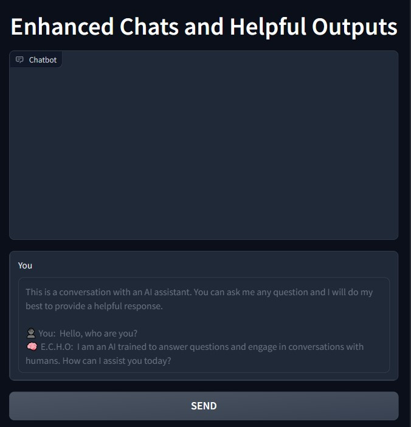

<div id="top"></div>

<!-- PROJECT LOGO -->
<br />
<div align="center">
  <a href="https://github.com/ralphcajipe/echo-ai">
    
  </a>

<h3 align="center">E.C.H.O. (Enhanced Chats and Helpful Outputs)
</h3>

  <p align="center">
    A CS50x Final Project
    <br />
    <a href="https://youtu.be/usxSciKi0FY" target="_blank">View Demo</a>
  </p>
</div>

# About E.C.H.O.

E.C.H.O. is an AI chatbot designed to assist with helpful, creative, clever,
and very friendly responses. It is a straightforward and convenient web
application
that utilizes the OpenAI API to generate human-like responses to user input.

## Project Structure
`~/project`
  * `images/` contains images used in the README.md file.
  * `app.py` is the main script that runs the chatbot interface.
  * `api.py` contains the api_request function that makes requests to the OpenAI
    API.
  * `api_key.py` contains the OpenAI API key.
  * `file_handler.py` contains the function for reading to files.
  * `initial.txt` contains the initial prompt for the OpenAI API.
  * `test_app.py` contains the unit tests for the app.py script.
  * `requirements.txt` contains the list of dependencies to be installed.
  * `README.md` is the file you are currently reading.

## Getting Started

1. This software requires Python version 3.7 or higher.
   You can download Python [here](https://www.python.org/downloads/).

2. Install the required libraries: `gradio` and `openai`.
```
pip install -r requirements.txt
```

3. Set up an [OpenAI API key](https://beta.openai.com/account/api-keys)
   and store it in a file called `api_key.py` as a string.

4. Run `app.py` to launch the chatbot interface.
````
python app.py
````

This will display a url to the chatbot interface in the terminal. Click it to open the web application. 
```
$ python app.py
Running on local URL:  http://127.9.9.1:7860
```

## How to Use the App


1. Enter your message in the textbox and click the "SEND" button.
2. E.C.H.O. will generate a response based on your input.
3. Continue the conversation by entering more messages and clicking the "SEND"
   button.

## Example Conversations

Here are a few example conversations with E.C.H.O.:

<b> Example 1: Recommendations </b>

```  
👤You: You are my anime guide. If I were to be transported into an anime world,
suggest 2 worlds where I can become a chef.

🧠E.C.H.O.: Here are two anime worlds where you might be able to become a chef:

Toriko: In the world of Toriko, chefs are highly respected and play a crucial
role in society. The series follows the adventures of a powerful chef named
Toriko, who travels the world searching for rare and exotic ingredients to
create the ultimate feast. As a chef in this world, you would have the
opportunity to explore diverse and fantastical environments, discover new
ingredients, and create culinary masterpieces.

Food Wars!: Shokugeki no Soma: In the world of Food Wars!, chefs are highly
skilled and passionate about their craft. The series follows a young chef named
Soma, who attends a prestigious culinary school where he competes against other
talented chefs in high-stakes cooking battles. As a chef in this world, you
would have the opportunity to hone your skills, compete in challenging culinary
competitions, and create delicious dishes.
```

<b> Example 2: Science </b>

```
👤You: Explain in one paragraph and simple English the conjecture of time travel
by Albert Einstein

🧠E.C.H.O.: Albert Einstein believed that it was theoretically possible to
travel through time by manipulating the laws of physics. He proposed that if
you could move at the speed of light or have a massive object, like a black
hole, warping the space-time around you, you could potentially travel through
time. However, Einstein also believed that it would be impossible for humans to
achieve these speeds or access these massive objects, so time travel remains a
theoretical concept.
```

<b> Example 3: Jokes </b>

```
👤You: Can you tell me a joke?

🧠E.C.H.O.: Sure, here's a joke: Why couldn't the bicycle stand up by itself?
Because it was two-tired.

👤You: Haha, that was a good one!

🧠E.C.H.O.: I'm glad you enjoyed it. Do you have any other requests?
```

## More Information

The app utilizes the OpenAI API and specifically the Davinci model - the most
capable
GPT-3 model. Davinci is known for its ability to understand and generate
natural language,
often with higher quality, longer output and better instruction-following
capabilities.

⌨️ Examples of Use:

* Asking for an explanation of a complex topic
* Asking for creative ideas for a poem or story
* Asking for help with a specific programming task

💪 Strengths:

* Remembering previous parts of the conversation
* Allowing the user to correct any mistakes
* Refusing inappropriate requests

⚠️Limitations:

* May sometimes provide incorrect information
* May sometimes provide harmful or biased content
* Has limited knowledge of world and events after June 2021. For more
  information,
  see [here](https://beta.openai.com/docs/models/gpt-3#:~:text=4%2C000%20tokens-,Up%20to%20Jun%202021,-text%2Dcurie%2D001)
  .

<!-- CONTACT -->

## Contact

Ralph Cajipe - [@ralphcode](https://twitter.com/ralphcode) -
ralphcajipe@gmail.com

Project
Link: [https://github.com/ralphcajipe/echo-ai](https://github.com/ralphcajipe/echo-ai)

<p align="right">(<a href="#top">back to top</a>)</p>

<!-- ACKNOWLEDGMENTS -->

## Acknowledgments

I would like to express my sincere appreciation to OpenAI's Davinci, Gradio,
Python's unittest, and Harvard's CS50 Staff for their invaluable contributions
to my learning and development.

The Davinci model has provided me with an incredible tool for understanding and
generating natural language, often with higher quality, longer output, and
better instruction-following capabilities. It has allowed me to delve deeper
into the field of artificial intelligence and build intelligent pieces of
software.

Gradio has been an invaluable resource for deploying machine learning models.
Its user-friendly interface that allowed for the seamless integration of the AI
model into a web application made it a pleasure to use.

Python's unittest unit testing framework has greatly helped me to ensure the
quality and functionality of my code.

Finally, I would like to thank the Harvard CS50 Staff for their excellent
teaching and support. Their expertise and encouragement were instrumental in
the successful completion of this work. I am grateful for the opportunity
to have studied under their guidance.

This was CS50!

* [OpenAI's Davinci](https://beta.openai.com/docs/models/gpt-3#:~:text=TRAINING%20DATA-,text%2Ddavinci%2D003,-Most%20capable%20GPT)
* [Gradio](https://gradio.app)
* [Python's unittest](https://docs.python.org/3/library/unittest.html)
* [Harvard CS50 Staff](https://cs50.harvard.edu/x/2022/staff/)

<p align="right">(<a href="#top">back to top</a>)</p>
